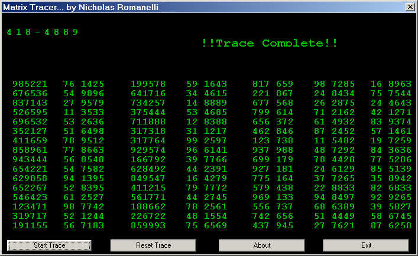



## The Matrix Tracer Program or just a really cool Random number Example

### Description

Hey guys, This is my first post to PSC, so bare with me :)

This program, is supposed to be the opening to the matrix. And also a really cool random number gen. I did this between 12 - 3 AM, so yea the code might be a little sloppy, and i'm sure you'll have coding techniques i could have used that would have been quicker. Well Check it out, And please PLEASE post some feedback. Also I'm sorry the code is not documented at all, I'll probably re-upload a documented version, but eveyrthingis pretty much self explanitory! ENJOY! and PLEASE VOTE!!!!
 
### More Info
 

             |
---                |---
**Submitted On**   |2001-02-21 12:15:58
**By**             |[Nick Romanelli](https://github.com/Planet-Source-Code/PSCIndex/blob/master/ByAuthor/nick-romanelli.md)
**Level**          |Beginner
**User Rating**    |5.0 (10 globes from 2 users)
**Compatibility**  |VB 6\.0
**Category**       |[Miscellaneous](https://github.com/Planet-Source-Code/PSCIndex/blob/master/ByCategory/miscellaneous__1-1.md)
**World**          |[Visual Basic](https://github.com/Planet-Source-Code/PSCIndex/blob/master/ByWorld/visual-basic.md)
**Archive File**   |[CODE\_UPLOAD152912212001\.zip](https://github.com/Planet-Source-Code/nick-romanelli-the-matrix-tracer-program-or-just-a-really-cool-random-number-example__1-21214/archive/master.zip)

